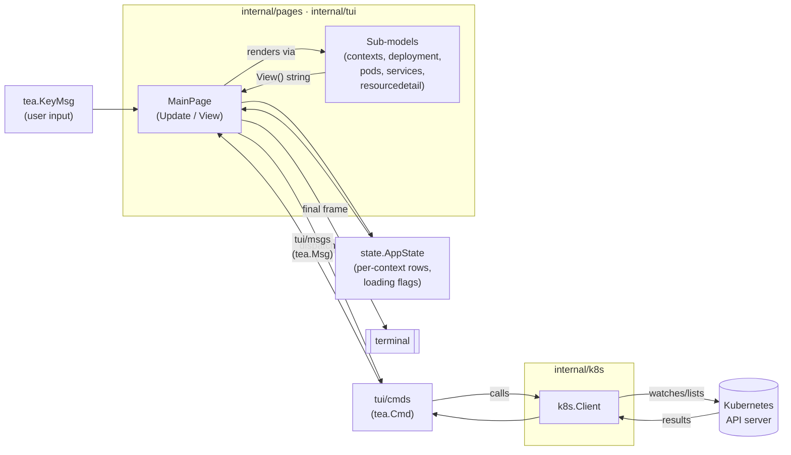
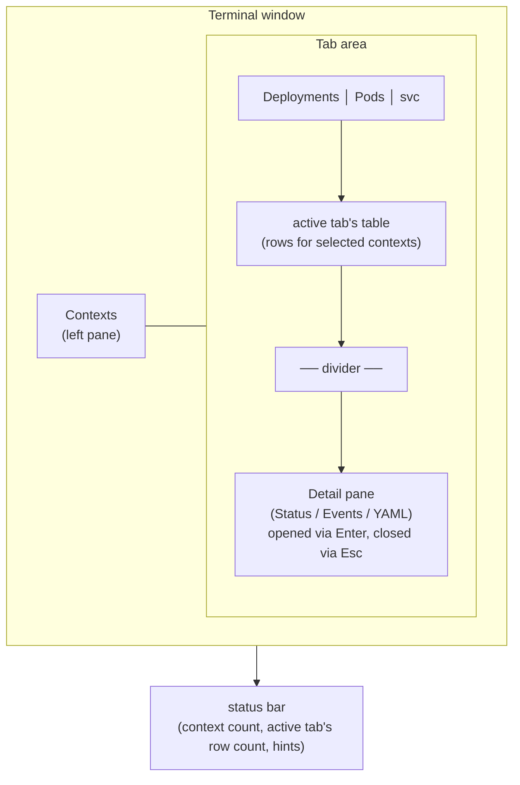
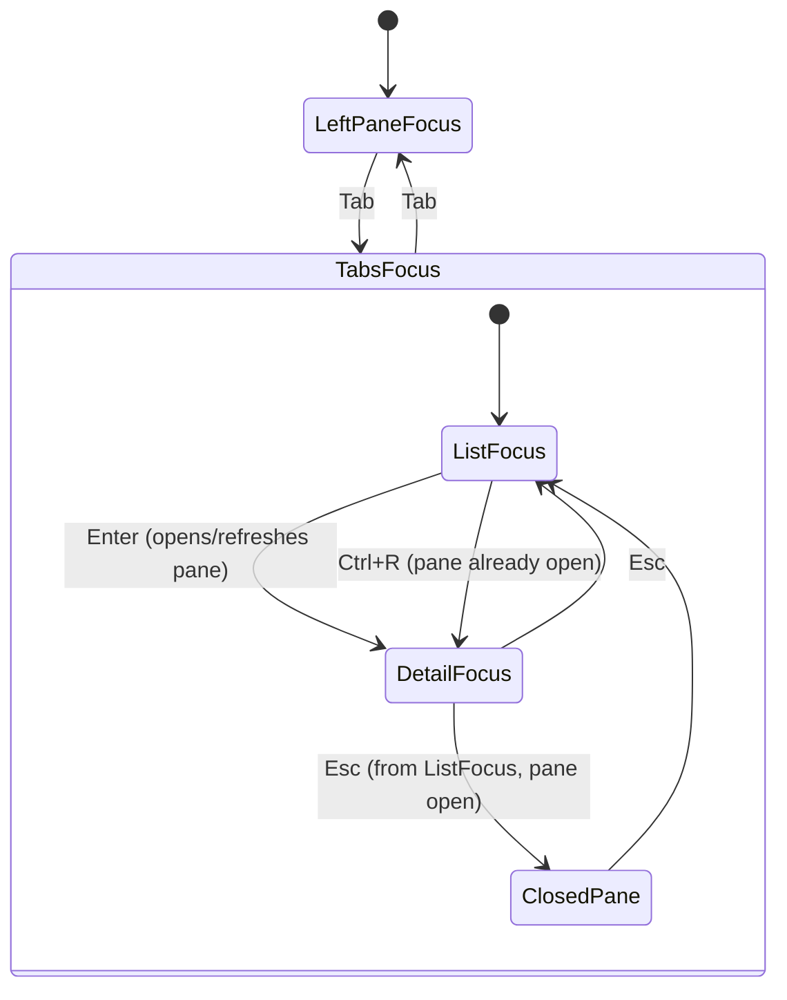

# KTails

A terminal-based Kubernetes resource browser built with Go and [Bubble Tea](https://github.com/charmbracelet/bubbletea).

Browse Deployments, Pods, and Services across multiple contexts at once, then drill into any
resource's live Status, Events, and YAML — all without leaving the terminal.

## Features

- **Multi-Context Support** — select several kubeconfig contexts and view their resources side by side
- **Three resource tabs** — Deployments, Pods, and svc (Services), each backed by live cluster data
- **Cross-cutting Detail pane** — press `Enter` on any row (in any of the three tabs) to open a bottom
  split-pane showing that resource's Status conditions, recent Events, and full YAML
- **Fast re-entry** — `Ctrl+R` jumps back into an already-open Detail pane without re-fetching;
  re-pressing `Enter` on the same row also refocuses instantly instead of reloading
- **Multi-Selection** — select multiple contexts to load and view their resources together
- **Beautiful theming** — Catppuccin Mocha color scheme with focus-aware styling throughout
- **Small-terminal guard** — below 80x24 the app shows a "resize your terminal" message instead of
  rendering a broken layout
- **Help overlay** — press `?` for the full keybinding reference

## Installation

### Prerequisites

- Go 1.25 or later
- kubectl configured with access to your Kubernetes clusters
- Valid kubeconfig file (default: `~/.kube/config`)

### Build from source

```bash
git clone https://github.com/ktails/ktails.git
cd ktails

make build      # -> ./build/ktails
./build/ktails
```

Or run directly without building a binary:

```bash
make run
```

### Debug mode

```bash
make debug      # sets KTAILS_DEBUG=1
```

## Usage

KTails starts on the context list. Select one or more contexts, load them, and browse their
Deployments, Pods, and Services. Press `Enter` on any row to see its full detail.

### Keyboard shortcuts

#### Global

| Key | Action |
|---|---|
| `q` / `Ctrl+C` | Quit |
| `Tab` / `Shift+Tab` | Switch focus between the context list and the tab area |
| `?` | Toggle the help overlay |
| `Esc` | Peel back one layer: unfocus Detail pane → close Detail pane → dismiss error → clear context errors |

#### Context list (left pane)

| Key | Action |
|---|---|
| `↑/↓` `j/k` | Move selection |
| `Space` | Toggle a context's selection |
| `Enter` | Confirm selection and load Deployments/Pods/Services for all selected contexts |

#### Tab area (Deployments / Pods / svc)

| Key | Action |
|---|---|
| `[` / `]` or `←` / `→` | Switch tabs (cross-cutting Detail pane stays open across tab switches) |
| `↑/↓` `j/k` | Move the row cursor |
| `Enter` | Open (or refresh) the Detail pane for the selected row, and focus it |

#### Detail pane (once focused, via `Enter`)

| Key | Action |
|---|---|
| `↑/↓` `j/k` `PgUp/PgDn` | Scroll |
| `Home`/`g` · `End`/`G` | Jump to top / bottom |
| `Esc` | Return focus to the row list (pane stays open) |
| `Esc` again | Close the pane |
| `Ctrl+R` | Jump back into the pane instantly, without re-fetching |

## Project layout

```
ktails/
├── cmd/
│   └── page-client/
│       └── main.go              # entry point
├── internal/
│   ├── config/                  # configuration management
│   ├── k8s/                     # Kubernetes client + per-resource data fetching
│   │   ├── client.go            #   context/pod listing, shared Client type
│   │   ├── deployments.go       #   Deployment list + detail (Status/Events/YAML)
│   │   ├── services.go          #   Service list + detail
│   │   └── detail.go            #   shared ResourceDetail type + event lookup
│   ├── state/
│   │   └── state.go             # AppState: per-context rows, loading flags, snapshot
│   ├── pages/
│   │   └── mainPage.go          # top-level Bubble Tea model (Update/View, layout, focus)
│   └── tui/
│       ├── cmds/                # tea.Cmd constructors that call into internal/k8s
│       ├── msgs/                # tea.Msg types carrying results back to mainPage
│       ├── models/               # per-tab sub-models (table wrappers, detail pane)
│       │   ├── contexts.go      #   context list (left pane)
│       │   ├── deployment.go    #   Deployments table
│       │   ├── pods.go          #   Pods table
│       │   ├── services.go      #   Services table
│       │   └── resourcedetail.go #  cross-cutting Status/Events/YAML pane
│       ├── styles/              # Catppuccin palette + shared lipgloss styles
│       └── views/                # layout helpers (panes, tab headers, min-size constants)
└── README.md
```

## Architecture

KTails follows the [Elm Architecture](https://guide.elm-lang.org/architecture/) via Bubble Tea: a
single root `MainPage` model owns `Update`/`View`, delegating per-tab rendering to sub-models and
per-resource data fetching to `internal/k8s`.

### Data flow



### Layout

The screen is split into a left context pane and a right tab area; the Detail pane is not a fourth
tab — it's a bottom split that any of the three tabs can open, and it persists across tab switches.



### Focus state machine



### Key components

- **`pages.MainPage`** — the root model; owns window dimensions, tab/focus state, and composes the
  final frame from its sub-models each render
- **`state.AppState`** — holds per-context Deployment/Pod/Service rows, loading flags, and errors;
  exposes a cached `Snapshot()` for cheap reads during render
- **`models.ContextsInfo`** — the left-pane context list with multi-select
- **`models.DeploymentPage` / `PodPage` / `ServicePage`** — thin wrappers around
  [`evertras/bubble-table`](https://github.com/Evertras/bubble-table) for each resource tab
- **`models.ResourceDetailPage`** — the shared, cross-cutting Detail pane (a `bubbles/viewport`
  showing Status/Events/YAML), reused regardless of which tab opened it
- **`k8s.Client`** — wraps `client-go`, supporting multiple contexts and both list (`GetDeploymentInfo`,
  `ListPodInfo`, `GetServiceInfo`) and single-resource detail (`GetDeploymentDetail`, `GetPodDetail`,
  `GetServiceDetail`) calls, the latter returning a common `k8s.ResourceDetail`

## Development

```bash
make build       # go build -o ./build/ktails ./cmd/page-client
make run         # go run ./cmd/page-client
make debug       # KTAILS_DEBUG=1 go run ./cmd/page-client
make test        # go test ./...
make test-one pkg=./internal/... name=TestFoo
make lint        # go vet ./... (+ staticcheck if installed)
make fmt         # gofmt -w .
make tidy        # go mod tidy
```

### Releasing

Releases are built and published automatically by [GoReleaser](https://goreleaser.com/) via
`.github/workflows/release.yml`, triggered by pushing a `v*` tag:

```bash
git tag v0.1.0
git push origin v0.1.0
```

That builds Linux/macOS/Windows binaries (amd64/arm64) with the version, commit, and build date
baked in (`./build/ktails version` or the packaged binary's `version` subcommand shows them), and
publishes a GitHub Release with archives and checksums.

To test the release build locally without publishing anything:

```bash
make release-check    # validate .goreleaser.yaml
make release-dry-run  # build all targets into ./dist with a snapshot version
```

### Adding a new resource tab

1. Add list/detail fetchers in `internal/k8s/` returning `[]YourInfo` and `k8s.ResourceDetail`
2. Add `YourResourceTableMsg` in `internal/tui/msgs/` and `LoadYourResourceInfoCmd`/`LoadYourResourceDetailCmd` in `internal/tui/cmds/`
3. Add a table model in `internal/tui/models/` (mirror `services.go`), with a hidden `Context`
   column so the Detail pane knows which cluster to query
4. Wire it into `state.AppState` (rows map, loading flag, snapshot field)
5. Add the tab to `pages.MainPage`: tab list, `Enter` handling in `openResourceDetail`, `View()`
   case, and `applyContentSizes`/focus-state wiring

## Dependencies

- [Bubble Tea v2](https://github.com/charmbracelet/bubbletea) — TUI framework
- [Bubbles v2](https://github.com/charmbracelet/bubbles) — TUI components (list, viewport)
- [Lip Gloss v2](https://github.com/charmbracelet/lipgloss) — styling and layout
- [bubble-table](https://github.com/Evertras/bubble-table) — the Deployments/Pods/svc tables
- [client-go](https://github.com/kubernetes/client-go) — Kubernetes client library
- [sigs.k8s.io/yaml](https://github.com/kubernetes-sigs/yaml) — YAML rendering for the Detail pane

## Roadmap

See [todo.md](./todo.md) for the detailed backlog.

## Contributing

Contributions are welcome — please open a Pull Request.

1. Follow Go best practices and idioms (see `AGENTS.md` for house conventions)
2. Run `make fmt` and `make lint` before committing
3. Update documentation for user-facing changes
4. Keep commits atomic and well-described

## License

GNU GENERAL PUBLIC LICENSE v3

## Acknowledgments

- Inspired by [k9s](https://k9scli.io/) and similar Kubernetes TUI tools
- Built with the [Charm](https://charm.sh/) TUI libraries
- Uses the [Catppuccin](https://github.com/catppuccin/catppuccin) color scheme

## Troubleshooting

### No contexts showing up

- Verify your kubeconfig is valid: `kubectl config view`
- Check context access: `kubectl config get-contexts`
- Enable debug mode: `make debug`

### Connection errors

- Ensure you can connect to your clusters: `kubectl cluster-info`
- Check your kubeconfig file permissions
- Verify network connectivity to the Kubernetes API servers

### Terminal too small

- KTails requires at least an 80x24 terminal; below that it shows a resize prompt instead of the UI

### Application crashes

- Enable debug mode to see detailed logs
- Report issues on GitHub with log output
